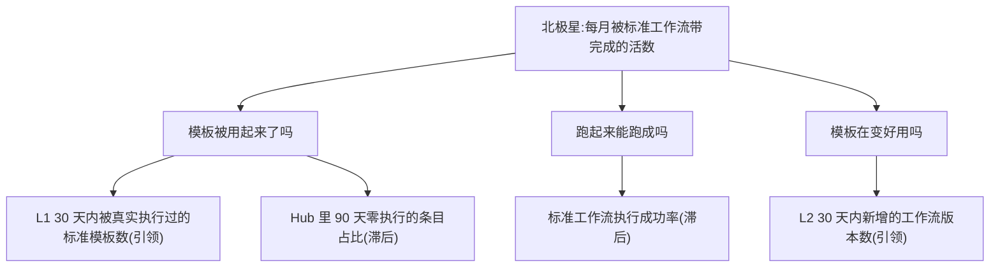

# 指标推导 · WorkflowHub(找指标)

本文档是同目录 `metrics.toml` 的人读推导过程,按升级后的「找指标」skill
(`docs/skills/north-star-discovery/SKILL.md`)第 8 步的要求写。

> **方法论来源(如实)**:北极星 6 判据打分、坏候选对照、BDFE 输入结构、
> NSM↔存续 KPI 系统校验,改编自 amplitude/builder-skills `north-star-metric`;
> 引领/滞后强制判定题、成对反指标、0-40 质量门与指标树乘法分解,改编自
> mohitagw15856/pm-claude-skills `metrics-framework` + `metric-tree-builder`。

---

## 0. 正本在哪、为什么(拍板记录)

推导完成时,WorkflowHub 在库里**没有工作区**:

```bash
sqlite3 ~/Library/Application\ Support/BuildersWorkbench/workbench.db \
  "SELECT name, workspace_path, remote_path FROM project WHERE name='WorkflowHub';"
# → WorkflowHub|| (两列都是空串)
```

没有工作区就没有地方放 `<workspace>/.bw/metrics.toml`,`SyncMetricsFile` 也
无从读起(它读的是 active 项目的工作区)。当时给出两条路,标为产品决定不代拍。

**2026-08-05 拍板:走第一条——给 WorkflowHub 挂 BW 仓当工作区。**

依据不是「找个地方放文件」,而是这个项目的自述原话(`project.descr`):

> 「Builders 工作台自己的 workflow 库:创建 / 优化 / 评估 wf 全生命周期。这次
> 创建过程本身也走 Builders 工作台的 Command 路径,**用这个仓库自己的真实 git
> 历史当证据**,不编造。」

它的工作区本来就该是 BW 仓。于是正本移到 `<BW 仓根>/.bw/metrics.toml`,和另外
两个项目走同一条路:改指标 = 改文件 = 走 PR 审核(plan/13 D5),同步后
`origin='file'`。

**被否掉的第二条路及其理由**:`UpsertManualMetric` 手建五行不用挂工作区、当场
能亮,但 ① 丢掉「指标定义走 PR」这条纪律;② **BW 目前没有任何删除指标的命令**
(全仓 `DeleteMetric`/`RemoveMetric`/`delete_metric` 零命中),手建进去就拿不
掉——aihot 项目此刻正因为这个问题,看板上留着两条已被判为坏候选的废弃手填指标。

**代价如实记账**:挂上工作区后,对 WorkflowHub 跑 `RunIssue` 会让 agent 在 BW
仓里真实改文件。`allow_commands` 因此设为 `false`。

**一处偏差**:本推导文档没有按惯例放在 `<工作区根>/docs/metrics-rationale.md`,
而是 `docs/metrics/workflowhub/metrics-rationale.md`——BW 仓的 `docs/` 下已经住
着大量本产品自己的文档,一份叫 `metrics-rationale.md` 的文件放在那里会被误读成
「BW 产品自己的指标推导」。

---

## 1. 输入摘要(每条都能 sqlite 读回)

| 输入 | 真实状态 |
|---|---|
| 项目意图(`project.descr`) | 「Builders 工作台自己的 workflow 库:**创建 / 优化 / 评估** wf 全生命周期。这次创建过程本身也走 Builders 工作台的 Command 路径,用这个仓库自己的真实 git 历史当证据,不编造。」 |
| 对标(`project.benchmark`) | OMC(oh-my-claudecode)角色分工地图、ECC(Everything Claude Code)角色分工地图 |
| 机会(`project.opportunity`) | 「把『workflow 是什么』从 OMC/ECC 那类**静态角色分工表**,升级成『workflow 现在在哪个阶段、该怎么演进』的**可管理对象**——五阶段各配一个可浏览、可导入、可执行的标准模板,而不只是一份名字列表。」 |
| 现行北极星(`project.north_star`) | 「5/5 阶段标准模板已入库,均可浏览 / 导入 / 执行」 |
| `workflow_spec` | **6 行**:`ecc-guide` + 五条阶段标准工作流(原型/构建/优化/运营推广/运维) |
| `workflow_version` | **0 行(全库)** |
| `workflow_run` | 全库 **13 次**:6 ok / 7 failed;其中属于 WorkflowHub 项目的只有 **1 次**(`ecc-guide`,ok)。**五条阶段标准模板的 run 数全部为 0** |
| 现有 metric 行 | 「Hub 工作流真实条目总数」(lagging,≥95,amber,1 个观测 = **97**)、「阶段标准模板持久化数」(leading·optimize,5/5,amber,2 个观测 = 5/5)、「阶段完成 Issue 数」×5(全 unknown,0 观测) |
| 项目 Issue 数 | **0** |
| 竞品分析报告 | **不存在**——本项目工作区都没有,自然也没有 `docs/competitive-analysis.md`。对标信息只有 `project.benchmark` 那两条(OMC / ECC),如实基于它推导,不假装读过报告 |

### 1.1 现行看板上那个 97,查不到出处

```bash
sqlite3 <db> "SELECT m.name,o.raw,o.source_kind,date(o.ts,'unixepoch')
              FROM metric m JOIN observation o ON o.metric_id=m.id
              WHERE m.name='Hub 工作流真实条目总数';"
# → Hub 工作流真实条目总数|97|manual|2026-07-10
```

这条观测 `source_kind='manual'`、`source_run_id` 为空、日期停在 **2026-07-10**
(距今 26 天)。而库里 `workflow_spec` 只有 **6** 行、`workflow_version` **0** 行
——**97 这个数字在库里没有任何可独立复核的来源**。不指控它是编的(它可能来自
当时某个外部 Hub 源的口径),但它现在的状态是:看板上有一个数,没人能顺着它
查回去。本轮不保留这条指标(理由见 §2.3 坏候选 ①)。

---

## 2. 北极星

### 2.1 三段拆解 + BDFE

- **供给**:模板被写出来、入库(5/5,**已经满分,且早在 2026-07-10 就满了**)。
- **使用**:有人真的浏览、导入、**执行**这些模板。
- **价值**:Builder 面对一个阶段时,**不用自己发明流程**——导一条模板进来,活被
  它带着走完;这正是机会陈述里「从静态分工表升级成可管理对象」的兑现。

BDFE(这个项目的"用户"是 Builder 本人 + BW 自己):

| 维 | 本项目的含义 | 用不用 |
|---|---|---|
| Breadth | 有多少条模板被真的用起来(≠ 库里有多少条) | ✓ 落到引领层 |
| Depth | 一次执行走完了多少个 phase / 带完成了几件活 | ✓ **主维** |
| Frequency | 多久用一次 | ✓ 30 天窗口 |
| Efficiency | 用模板 vs 自己从零写 prompt,省下多少 | ✗ 无基线,不编 |

→ 北极星取 **Depth**:被这些工作流真正带到 Done 的活数。

### 2.2 6 判据打分(任一项 ≤2 直接淘汰)

候选:**「每月被标准工作流带完成的活数」**

| # | 判据 | 分 | 依据 |
|---|---|---|---|
| 1 | 落位 | **4** | 落在使用/价值交界:量的是「工作流把活带完成了」。扣 1 分——严格说「活完成」的价值归属于那件活本身,工作流的贡献是间接的,这条链条我没有独立证据 |
| 2 | 自动化免疫 | **5** | BW 自己的产品铁律当护栏:**Done 永不自动**,InReview→Done 只能来自人显式点的 `TransitionIssue`(状态机 `can_transition_to` 里 Done 的入边只有 InReview),Autopilot 只自动**建**活。挂再多定时任务也刷不动这条指标 |
| 3 | 场景契合 | **5** | 直接对上机会陈述:「可管理对象」而不是「一份名字列表」——名字列表的指标是条目数,可管理对象的指标是它带完成了什么 |
| 4 | 定义精确 | **4** | 分子/窗口/关联口径(`workflow_run.issue_id` × `workflow_spec`)写死了,SQL 见 §7。扣 1 分:一件活跑过多条工作流时按「至少一条」计,没有做归因拆分 |
| 5 | 采集诚实 | **4** | 标 `bw`——它就是 BW 自己的记账,不是外部系统。如实说明:采集器 v1 **未接** `bw` 这一类,所以它会老老实实显示 Unknown 灰,不会假绿。扣 1 分正是因为它现在采不到 |
| 6 | 难造假 + 反指标 | **4** | 最省力的作弊是把活拆碎(一件拆成五件),已配反指标见 §5 |

无一项 ≤2 → 通过。

### 2.3 故意的坏候选对照(每条写清被哪一项判据挡下)

1. **「Hub 工作流真实条目总数」(现行看板上真实存在,值 97,target ≥95)**。
   判据 1 落位 **1 分**:纯供给段——库里躺着多少条,和有没有人用一点关系没有。
   判据 2 自动化免疫 **1 分**:跑一次导入脚本它就涨(BW 仓里就有
   `import_skill_library` / `import_ecc_agents` 这类真实存在的批量导入例子),
   等于「挂一条永不失败的任务就永久满分」。**外加 §1.1 那个问题:这个数字在库里
   查不到出处,且已经 26 天没更新。** 三项叠加 → 不保留。
2. **「5/5 阶段标准模板已入库,均可浏览 / 导入 / 执行」(现行北极星)**。
   判据 1 落位 **1 分**(供给段:模板被生产出来);更致命的是它**已经满分且不可能
   再动**——一条永远 5/5 的北极星等于没有北极星,`docs/metrics-toml-format.md`
   意义上它连一个可变的观测都不会再产生。它还夹带了一个**未经验证的断言**:
   「均可浏览 / 导入 / **执行**」——真实读回,这五条模板的 `workflow_run` 数
   **全部为 0**,从 2026-07-10 入库至今一次都没被执行过。「可执行」在这里是
   「代码上支持」,不是「真的执行过」,北极星里不该混进这种未验证的形容词。
3. **「workflow_run 总次数」**。判据 2 自动化免疫 **1 分**、判据 6 难造假 **2 分**:
   失败也是一次 run——真实数据直接打脸,13 次 run 里 **7 次是 failed**,把总次数
   当北极星等于奖励重试。

### 2.4 北极星的反指标(不进 metrics.toml,只作护栏)

**「被标准工作流带完成的活,7 天内被重开 / 返工的比例」**。这条北极星最省力的
作弊法是**把活拆碎**——一件事拆成五件,数字翻五倍而实际产出没变;或者潦草结算
换数量。返工率是这两种动作共同的指纹。BW 侧有现成的判据面(Issue 状态机的
回退与重开),下次复核北极星先看这条有没有恶化。

### 2.5 NSM ↔ 存续 KPI 的系统校验

WorkflowHub 是 BW 的内部平台组件,不直接产生收入,传导链的终点是 **BW 这个产品
自身的核心命题能否兑现**:

> 被标准工作流带完成的活数 ↑ → 「管理体系自带,不用用户发明」这条命题有了真实
> 证据 → 新项目上手时不必自己发明流程 → BW 的差异化(相对 OMC/ECC 那类静态分工
> 表)成立 → 产品存续。

**诚实标注:纯逻辑推演,零真实数据验证。** 目前唯一沾边的真实观察是反方向的:
五条标准模板零执行、`workflow_version` 全库零行——「模板存在」到「模板被用起来」
这一步,至今没有发生过一次。

---

## 3. 指标树与最高杠杆

```
每月被标准工作流带完成的活数
  = 被用起来的模板数 × 每条模板的执行次数 × 执行成功率 × 每次成功带完成的活数
        └── L1            └──(未单列)         └── Lag1      └──(未单列)
```



**最高杠杆的两条**:

1. **L1 被真实执行过的模板数(0/5 → ≥3)**:它是乘法链的第一个因子,现在是 **0**,
   所以北极星必然是 0——这与「模板好不好」无关,是「从来没被用过」。让任意一条
   阶段模板真的跑一次,是整棵树上唯一能立刻产生非零值的动作。
2. **Lag1 执行成功率(46.2% → ≥70%)**:13 次 run 里 7 次 failed,且失败集中在
   2026-07-20~24 那几天。**这个失败率必须先做归因**——BW 仓的实践记录里,那段
   时间的失败大量来自网关 529 抖动与账号配额,属于环境而非工作流本身;不做归因
   就拿 46.2% 当工作流质量的证据,是把环境问题算到产品头上。归因方法写在 §7。

---

## 4. 引领/滞后:强制判定题逐条过

判定题:(a) 当下/事前能被直接影响吗?(b) 对结果有预测性吗?两条都「是」→ 引领。

| 指标 | (a) 当下可影响 | (b) 有预测性 | 判定 |
|---|---|---|---|
| 30 天内被真实执行过的标准模板数 | 是(去跑一次就 +1) | 是(乘法链第一因子) | **引领** |
| 30 天内新增的工作流版本数 | 是(改一版就 +1) | 是(模板不迭代不会变好用) | **引领** |
| 标准工作流执行成功率 | **否**(跑完才知道,当下拧不动) | 是 | **滞后** |
| Hub 里 90 天零执行的条目占比 | **否**(只能靠一次次真实使用慢慢化掉) | 是 | **滞后** |

**被删掉的两条现有指标**:

- **「阶段标准模板持久化数」(5/5,现行 leading·optimize)** — 过不了判定题 (b):
  它已经永久满分,不可能再变化,对任何结果都不再有预测性。一条不会动的指标不是
  引领指标,是一块纪念牌。
- **「阶段完成 Issue 数」×5(五个阶段各一条,全 unknown、0 观测)** — 这是 BW 给
  每个项目自动铺的**通用项目管理指标**,不是 WorkflowHub 自己的业务指标;按
  plan/18 §1.1 的分层,它属于「层 B·buddy 固有项目管理指标」,只当现状数显示、
  不掺进业务北极星链路。本轮不把它写进业务正本(也不删库里的行——那是层 B 自己
  的事)。

---

## 5. 成对反指标(每条可优化的指标都配)

| 指标 | 反指标 | 它挡的具体作弊动作 |
|---|---|---|
| 北极星 带完成的活数 | **7 天内重开/返工率** | 把活拆碎凑数量;潦草结算换数量 |
| L1 被执行过的模板数 | **标准工作流执行成功率** | 为凑「被执行过」而空跑一遍模板、跑挂了也算「执行过」 |
| L2 新增工作流版本数 | **被执行过的模板数** | 疯狂改版本刷数字,而改出来的版本没有一条被真的跑过 |
| Lag1 执行成功率 | **workflow_run 总次数** | 只跑最保险的那条(如 `ecc-guide`)、不碰复杂的阶段模板,成功率自然好看而总量停滞 |
| Lag2 零执行占比 | **Hub 条目总数** | 靠**删掉**不用的条目把占比压下去,而不是靠把它们用起来 |

---

## 6. 阈值怎么校准的(每条都指回真实水位)

| 指标 | 真实水位(2026-08-05 读回) | 定的线 | 为什么是这条线 |
|---|---|---|---|
| 北极星 | 无法计算(采集器 v1 未接 `bw`) | 不设 target | 北极星本就没有 target 字段;在拿到第一个真实月度值之前,任何目标数都是编的 |
| L1 被执行过的模板数 | **0/5** | ≥3 | 从零起步。终点是 5/5(五个阶段都真的被用过),先卡 3 是为了留梯度。**升级规则**:连续两个月 ≥3 后上调到 5,并在本文件留一次修改记录 |
| L2 新增版本数 | **0**(workflow_version 全库零行) | ≥1 | 「优化 / 评估」这半个生命周期至今零发生;≥1/月 是「这半段真的活着」的最低证据 |
| Lag1 执行成功率 | **46.2%**(6 ok / 13 run) | ≥70% | 高于现状、留出环境抖动的余量。**前提是先做 §7 的失败归因**,把网关/配额类失败与工作流自身失败分开,否则这条线守的是别人的问题 |
| Lag2 零执行占比 | **83.3%**(6 条 spec 只有 1 条跑过) | ≤20% | 允许库里有少量"备着不常用"的条目,但不允许八成是死的 |

---

## 7. 采集方案的诚实评估 + 可独立复核的 SQL

**五条全部 `collect.kind = "bw"`**——这个项目的数据**全部住在 BW 自己的库里**
(`workflow_spec` / `workflow_run` / `workflow_version` / `issue`),不经任何外部
系统,`bw` 是语义上唯一正确的 kind。

**诚实说明:采集器 v1 未接 `bw` 这一类**(见 `docs/metrics-toml-format.md` 的
采集器状态表)。所以这五条落库后会**全部显示 Unknown 灰**,不会假绿。这比现在
看板上那个 26 天没更新、查不到出处的手填 97 诚实——它们采不到,但每一条都写死了
可以当场 `sqlite3` 跑出来的口径:

```bash
DB=~/Library/Application\ Support/BuildersWorkbench/workbench.db

# L1:30 天内被真实执行过的标准模板数(0-5)
sqlite3 "$DB" "SELECT COUNT(DISTINCT ws.id) FROM workflow_spec ws
  JOIN workflow_run wr ON wr.workflow_id = ws.id
  WHERE ws.name LIKE '%标准工作流%'
    AND wr.started_at >= strftime('%s','now','-30 days');"

# L2:30 天内新增的工作流版本数
sqlite3 "$DB" "SELECT COUNT(*) FROM workflow_version
  WHERE created_at >= strftime('%s','now','-30 days');"

# Lag1:标准工作流执行成功率(30 天窗口)
sqlite3 "$DB" "SELECT SUM(status='ok')*1.0/COUNT(*) FROM workflow_run
  WHERE started_at >= strftime('%s','now','-30 days');"

# Lag2:Hub 里 90 天零执行的条目占比
sqlite3 "$DB" "SELECT SUM(runs=0)*1.0/COUNT(*) FROM
  (SELECT ws.id, (SELECT COUNT(*) FROM workflow_run wr
     WHERE wr.workflow_id=ws.id
       AND wr.started_at >= strftime('%s','now','-90 days')) AS runs
   FROM workflow_spec ws);"

# 北极星:30 天内被标准工作流带到 Done 的活数
sqlite3 "$DB" "SELECT COUNT(DISTINCT i.id) FROM issue i
  JOIN workflow_run wr ON wr.issue_id = i.id
  JOIN workflow_spec ws ON ws.id = wr.workflow_id
  WHERE i.settled_at IS NOT NULL
    AND i.settled_at >= strftime('%s','now','-30 days');"

# §3 要求的失败归因(把网关/配额类失败与工作流自身失败分开)
sqlite3 "$DB" "SELECT substr(error,1,80), COUNT(*) FROM workflow_run
  WHERE status='failed' GROUP BY substr(error,1,80) ORDER BY 2 DESC;"
```

**埋点缺口**:要把这五条从 Unknown 点亮,缺的不是脚本而是 **`bw` 这一类采集器
本身**(`docs/metrics-toml-format.md` 记为「v1 未接,留给后续票接 BW 自记账
口径」)。上面这几条 SQL 就是它接进来时该实现的口径,已经写成可执行形式,不用
再猜。

---

## 8. 0-40 质量门自评(<24 分退回重做)

| 判据(每项 0-10) | 得分 | 依据 |
|---|---|---|
| 分类诚实 | **9** | 两条引领都过了判定题;把两条**现有**指标明确剔除并写清理由(一条永久满分因而无预测性,一条是层 B 通用管理指标不该混进业务链路);没有为了让看板好看把库存类指标留在引领层 |
| 预测性 | **8** | L1/L2 在乘法链上各占一个因子,是构成关系。扣 2 分:「模板被用起来 → 活被带完成」这一步没有独立证据,当前 L1=0,整条链一次都没被真实走通过 |
| 阈值真实 | **8** | 四条阈值全部指回当场读回的真实数字(0/5、0、46.2%、83.3%),并写了 L1 的上调规则。扣 2 分:Lag1 的 ≥70% 建立在「失败归因之后」这个尚未完成的前提上 |
| 防作弊完整 | **9** | 五条逐条配对,且专门堵住这个项目最容易的两条路(空跑刷「执行过」、删条目刷「零执行占比」)。扣 1 分:反指标全靠人自觉复核,无强制机制 |

**合计 34/40**(≥24 通过;mohit 口径的 ship-quality 线是 32)。

---

## 9. 复核节奏

- **每月**:先看 L1(被执行过的模板数)。它是 0 的时候,北极星必然是 0,盯北极星
  没有信息量。
- **第一次 L1 > 0 之后**:立刻做 §3 说的失败归因,把 Lag1 的 46.2% 拆成「环境
  失败」与「工作流自身失败」,再决定 ≥70% 这条线要不要重定。
- **每季度**:重跑 §2.2 的 6 判据打分与 §5 的反指标复核。任何指标改名/改定义都
  在本文件留一次记录,不静默改写历史。
